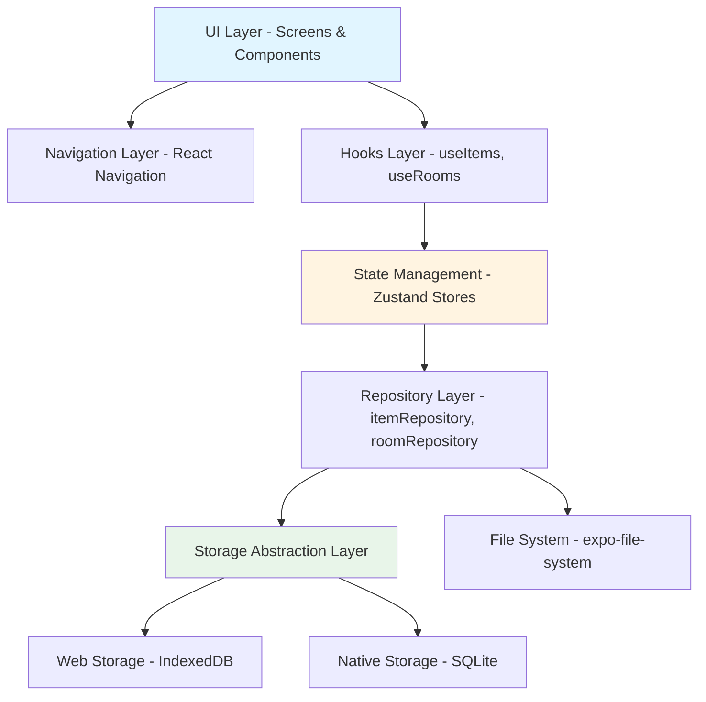
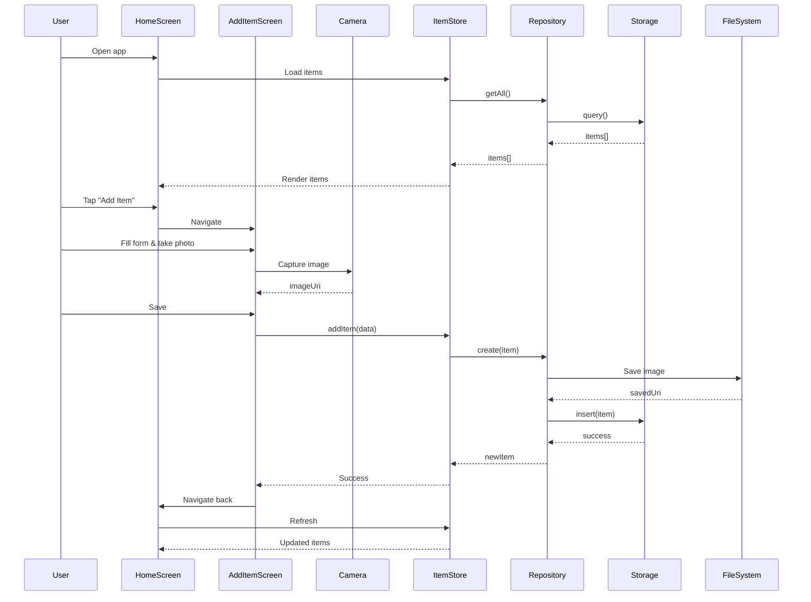

# Design Document: Find My Stuff

## Overview

Find My Stuff is a cross-platform mobile application built with React Native and Expo that helps users track the physical location of their belongings. The app provides an offline-first personal inventory system where users can photograph items, assign them to rooms, and quickly search for them later. The architecture emphasizes performance (handling 10,000+ items), platform abstraction (iOS, Android, Web), and extensibility for future features like AI recognition and cloud sync.

The system uses TypeScript for type safety, Zustand for lightweight state management, and a repository pattern with platform-specific storage implementations (SQLite for mobile, IndexedDB for web). The design prioritizes fast fuzzy search, virtualized lists, and a clean component architecture that separates UI, business logic, and data persistence.

## Architecture




## Main Application Workflow




## Components and Interfaces

### Storage Abstraction Layer

**Purpose**: Provide unified interface for data persistence across platforms

**Interface**:
```typescript
interface IStorage {
  // Item operations
  insertItem(item: Item): Promise<void>
  updateItem(id: string, updates: Partial<Item>): Promise<void>
  deleteItem(id: string): Promise<void>
  getItem(id: string): Promise<Item | null>
  getAllItems(): Promise<Item[]>
  searchItems(query: string): Promise<Item[]>
  
  // Room operations
  insertRoom(room: Room): Promise<void>
  updateRoom(id: string, updates: Partial<Room>): Promise<void>
  deleteRoom(id: string): Promise<void>
  getRoom(id: string): Promise<Room | null>
  getAllRooms(): Promise<Room[]>
  
  // Batch operations
  clearAll(): Promise<void>
  exportData(): Promise<{ items: Item[], rooms: Room[] }>
  importData(data: { items: Item[], rooms: Room[] }): Promise<void>
}
```

**Responsibilities**:
- Abstract platform-specific storage implementations
- Provide consistent async API for data operations
- Handle transactions and error recovery
- Support batch operations for import/export


### Repository Layer

**Purpose**: Business logic layer between stores and storage

**Interface**:
```typescript
interface ItemRepository {
  create(itemData: Omit<Item, 'id' | 'createdAt' | 'updatedAt'>): Promise<Item>
  update(id: string, updates: Partial<Item>): Promise<Item>
  delete(id: string): Promise<void>
  getById(id: string): Promise<Item | null>
  getAll(): Promise<Item[]>
  getByRoom(roomId: string): Promise<Item[]>
  search(query: string): Promise<Item[]>
  saveImage(uri: string): Promise<string>
  deleteImage(uri: string): Promise<void>
}

interface RoomRepository {
  create(roomData: Omit<Room, 'id' | 'createdAt'>): Promise<Room>
  update(id: string, updates: Partial<Room>): Promise<Room>
  delete(id: string): Promise<void>
  getById(id: string): Promise<Room | null>
  getAll(): Promise<Room[]>
  getItemCount(roomId: string): Promise<number>
}
```

**Responsibilities**:
- Generate IDs and timestamps
- Validate data before persistence
- Handle image file operations
- Coordinate between storage and file system
- Implement business rules (e.g., prevent room deletion if items exist)


### State Management Layer

**Purpose**: Global state management with Zustand

**Interface**:
```typescript
interface ItemStore {
  items: Item[]
  loading: boolean
  error: string | null
  
  // Actions
  loadItems(): Promise<void>
  addItem(itemData: Omit<Item, 'id' | 'createdAt' | 'updatedAt'>): Promise<void>
  updateItem(id: string, updates: Partial<Item>): Promise<void>
  deleteItem(id: string): Promise<void>
  searchItems(query: string): Item[]
  getItemsByRoom(roomId: string): Item[]
  clearError(): void
}

interface RoomStore {
  rooms: Room[]
  loading: boolean
  error: string | null
  
  // Actions
  loadRooms(): Promise<void>
  addRoom(roomData: Omit<Room, 'id' | 'createdAt'>): Promise<void>
  updateRoom(id: string, updates: Partial<Room>): Promise<void>
  deleteRoom(id: string): Promise<void>
  getRoomById(id: string): Room | undefined
  getItemCount(roomId: string): number
  clearError(): void
}
```

**Responsibilities**:
- Maintain in-memory cache of items and rooms
- Provide synchronous access to data for UI
- Handle loading and error states
- Coordinate with repositories for persistence
- Implement client-side search and filtering


### UI Components

**Purpose**: Reusable presentation components

**ItemCard Component**:
```typescript
interface ItemCardProps {
  item: Item
  room: Room
  onPress: (item: Item) => void
  onLongPress?: (item: Item) => void
}

const ItemCard: React.FC<ItemCardProps> = ({ item, room, onPress, onLongPress }) => {
  // Renders: image thumbnail, item name, room badge, specific location, timestamp
  // Handles: press events, image loading states
}
```

**RoomCard Component**:
```typescript
interface RoomCardProps {
  room: Room
  itemCount: number
  onPress: (room: Room) => void
}

const RoomCard: React.FC<RoomCardProps> = ({ room, itemCount, onPress }) => {
  // Renders: room icon, name, item count, color accent
  // Handles: press events
}
```

**SearchBar Component**:
```typescript
interface SearchBarProps {
  value: string
  onChangeText: (text: string) => void
  placeholder?: string
  autoFocus?: boolean
}

const SearchBar: React.FC<SearchBarProps> = ({ value, onChangeText, placeholder, autoFocus }) => {
  // Renders: search input with icon, clear button
  // Handles: debounced input, clear action
}
```

**FloatingButton Component**:
```typescript
interface FloatingButtonProps {
  onPress: () => void
  icon: string
  label?: string
}

const FloatingButton: React.FC<FloatingButtonProps> = ({ onPress, icon, label }) => {
  // Renders: circular FAB with icon
  // Handles: press with haptic feedback
}
```


## Data Models

### Item Model

```typescript
type Item = {
  id: string                // UUID v4
  name: string              // User-provided item name
  imageUri: string          // Local file path to image
  roomId: string            // Foreign key to Room
  specificLocation: string  // e.g., "Top shelf, left side"
  createdAt: number         // Unix timestamp (ms)
  updatedAt: number         // Unix timestamp (ms)
}
```

**Validation Rules**:
- `id`: Must be valid UUID v4 format
- `name`: Required, 1-100 characters, trimmed
- `imageUri`: Required, must be valid file path
- `roomId`: Required, must reference existing room
- `specificLocation`: Required, 1-200 characters, trimmed
- `createdAt`: Required, positive integer
- `updatedAt`: Required, positive integer, >= createdAt

**Indexes** (for performance):
- Primary: `id`
- Secondary: `roomId` (for room filtering)
- Full-text: `name`, `specificLocation` (for search)


### Room Model

```typescript
type Room = {
  id: string           // UUID v4
  name: string         // User-provided room name
  icon: string         // Icon identifier (e.g., "kitchen", "bedroom")
  color: string        // Hex color code
  description?: string // Optional description
  createdAt: number    // Unix timestamp (ms)
}
```

**Validation Rules**:
- `id`: Must be valid UUID v4 format
- `name`: Required, 1-50 characters, trimmed, unique
- `icon`: Required, must be from predefined icon set
- `color`: Required, must be valid hex color (#RRGGBB)
- `description`: Optional, max 200 characters, trimmed
- `createdAt`: Required, positive integer

**Predefined Icons**:
- kitchen, bedroom, living-room, bathroom, garage, office, hallway, closet, basement, attic, storage, outdoor

**Predefined Colors**:
- #FF6B6B, #4ECDC4, #45B7D1, #FFA07A, #98D8C8, #F7DC6F, #BB8FCE, #85C1E2

**Indexes**:
- Primary: `id`
- Unique: `name`


## Key Functions with Formal Specifications

### Function 1: fuzzySearch()

```typescript
function fuzzySearch(
  items: Item[],
  query: string,
  rooms: Room[]
): Item[]
```

**Preconditions:**
- `items` is a valid array (may be empty)
- `query` is a string (may be empty)
- `rooms` is a valid array containing all referenced rooms
- All items in `items` have valid `roomId` references in `rooms`

**Postconditions:**
- Returns array of items matching the query
- If `query` is empty, returns all items
- Results are sorted by relevance score (highest first)
- No duplicate items in results
- All returned items exist in input `items` array
- Original `items` array is not mutated

**Algorithm Complexity:**
- Time: O(n * m) where n = items.length, m = query.length
- Space: O(n) for result array


### Function 2: saveImage()

```typescript
async function saveImage(
  sourceUri: string,
  fileSystem: FileSystem
): Promise<string>
```

**Preconditions:**
- `sourceUri` is a valid URI (file://, content://, or http://)
- `fileSystem` is initialized and has write permissions
- Source image exists and is accessible
- Sufficient storage space available

**Postconditions:**
- Returns permanent file path in app's document directory
- Image is copied from source to permanent location
- Image format is preserved (JPEG, PNG, etc.)
- If source is temporary (camera), original is not deleted
- Throws error if copy fails or storage full
- No side effects on source file

**Error Conditions:**
- Throws `StorageError` if insufficient space
- Throws `FileNotFoundError` if source doesn't exist
- Throws `PermissionError` if no write access


### Function 3: deleteRoom()

```typescript
async function deleteRoom(
  roomId: string,
  itemRepository: ItemRepository,
  roomRepository: RoomRepository
): Promise<void>
```

**Preconditions:**
- `roomId` is a valid UUID string
- `itemRepository` and `roomRepository` are initialized
- Room with `roomId` exists in storage

**Postconditions:**
- If room has no items: room is deleted from storage
- If room has items: throws `RoomNotEmptyError` without deletion
- No orphaned items (items without valid roomId)
- Transaction is atomic (all-or-nothing)
- Room count decreases by 1 if successful

**Business Rules:**
- Cannot delete room with existing items
- User must reassign or delete items first
- System prevents orphaned data


### Function 4: loadItems()

```typescript
async function loadItems(
  storage: IStorage,
  setState: (items: Item[]) => void
): Promise<void>
```

**Preconditions:**
- `storage` is initialized and connected
- `setState` is a valid state setter function
- Storage schema is up-to-date

**Postconditions:**
- All items from storage are loaded into state
- Items are sorted by `updatedAt` descending (most recent first)
- Loading state is set to false after completion
- Error state is cleared on success
- If storage fails, error state is set and items remain unchanged
- Function is idempotent (can be called multiple times safely)

**Performance:**
- Must complete in < 500ms for 10,000 items
- Uses batch loading if item count > 1,000


## Algorithmic Pseudocode

### Main Search Algorithm

```typescript
/**
 * Fuzzy search algorithm with multi-field matching and relevance scoring
 */
function fuzzySearch(items: Item[], query: string, rooms: Room[]): Item[] {
  // Step 1: Normalize query
  const normalizedQuery = query.toLowerCase().trim()
  
  // Early return for empty query
  if (normalizedQuery.length === 0) {
    return items
  }
  
  // Step 2: Create room lookup map for O(1) access
  const roomMap = new Map<string, Room>()
  for (const room of rooms) {
    roomMap.set(room.id, room)
  }
  
  // Step 3: Score each item
  const scoredItems: Array<{ item: Item; score: number }> = []
  
  for (const item of items) {
    const room = roomMap.get(item.roomId)
    if (!room) continue // Skip items with invalid room references
    
    let score = 0
    
    // Score item name (highest weight)
    score += calculateMatchScore(item.name.toLowerCase(), normalizedQuery) * 3
    
    // Score specific location (medium weight)
    score += calculateMatchScore(item.specificLocation.toLowerCase(), normalizedQuery) * 2
    
    // Score room name (lowest weight)
    score += calculateMatchScore(room.name.toLowerCase(), normalizedQuery) * 1
    
    // Only include items with positive score
    if (score > 0) {
      scoredItems.push({ item, score })
    }
  }
  
  // Step 4: Sort by score descending
  scoredItems.sort((a, b) => b.score - a.score)
  
  // Step 5: Extract items
  return scoredItems.map(({ item }) => item)
}
```

**Preconditions:**
- `items` is a valid array
- `query` is a string
- `rooms` contains all rooms referenced by items
- All `item.roomId` values exist in `rooms`

**Postconditions:**
- Returns filtered and sorted array
- No duplicates in result
- Original arrays not mutated
- Results sorted by relevance (highest score first)

**Loop Invariants:**
- Room map contains all processed rooms
- All scored items have positive scores
- No duplicate items in scoredItems array


### Match Score Calculation

```typescript
/**
 * Calculate match score between text and query using substring matching
 */
function calculateMatchScore(text: string, query: string): number {
  // Exact match (highest score)
  if (text === query) {
    return 100
  }
  
  // Starts with query (high score)
  if (text.startsWith(query)) {
    return 80
  }
  
  // Contains query as substring (medium score)
  if (text.includes(query)) {
    return 50
  }
  
  // Character-by-character fuzzy match (low score)
  let matchCount = 0
  let textIndex = 0
  
  for (let i = 0; i < query.length; i++) {
    const char = query[i]
    const foundIndex = text.indexOf(char, textIndex)
    
    if (foundIndex !== -1) {
      matchCount++
      textIndex = foundIndex + 1
    }
  }
  
  // Score based on percentage of matched characters
  const matchPercentage = matchCount / query.length
  return matchPercentage >= 0.6 ? matchPercentage * 30 : 0
}
```

**Preconditions:**
- `text` and `query` are lowercase strings
- Both strings are trimmed

**Postconditions:**
- Returns score between 0 and 100
- Higher score indicates better match
- Score of 0 means no match
- Exact match always returns 100

**Scoring Tiers:**
- 100: Exact match
- 80: Starts with query
- 50: Contains query
- 0-30: Fuzzy character match (60%+ characters matched)
- 0: No match


### Image Save Algorithm

```typescript
/**
 * Save image from temporary location to permanent storage
 */
async function saveImage(sourceUri: string, fileSystem: FileSystem): Promise<string> {
  // Step 1: Validate source URI
  if (!sourceUri || sourceUri.trim().length === 0) {
    throw new Error('Invalid source URI')
  }
  
  // Step 2: Check if source file exists
  const sourceExists = await fileSystem.getInfoAsync(sourceUri)
  if (!sourceExists.exists) {
    throw new FileNotFoundError(`Source file not found: ${sourceUri}`)
  }
  
  // Step 3: Generate unique filename
  const timestamp = Date.now()
  const randomId = generateUUID()
  const extension = getFileExtension(sourceUri) || 'jpg'
  const filename = `item_${timestamp}_${randomId}.${extension}`
  
  // Step 4: Determine permanent directory
  const permanentDir = `${fileSystem.documentDirectory}images/`
  
  // Step 5: Ensure directory exists
  const dirInfo = await fileSystem.getInfoAsync(permanentDir)
  if (!dirInfo.exists) {
    await fileSystem.makeDirectoryAsync(permanentDir, { intermediates: true })
  }
  
  // Step 6: Copy file to permanent location
  const destinationUri = `${permanentDir}${filename}`
  
  try {
    await fileSystem.copyAsync({
      from: sourceUri,
      to: destinationUri
    })
  } catch (error) {
    if (error.code === 'ENOSPC') {
      throw new StorageError('Insufficient storage space')
    }
    throw error
  }
  
  // Step 7: Verify destination file exists
  const destExists = await fileSystem.getInfoAsync(destinationUri)
  if (!destExists.exists) {
    throw new Error('Failed to save image')
  }
  
  return destinationUri
}
```

**Preconditions:**
- `sourceUri` is valid and accessible
- `fileSystem` has write permissions
- Sufficient storage space available

**Postconditions:**
- Image copied to permanent location
- Returns permanent file path
- Original source file unchanged
- Destination directory created if needed
- Throws error on failure (no partial state)

**Error Handling:**
- `FileNotFoundError`: Source doesn't exist
- `StorageError`: Insufficient space
- `PermissionError`: No write access


### Room Deletion Algorithm

```typescript
/**
 * Delete room with safety checks to prevent orphaned items
 */
async function deleteRoom(
  roomId: string,
  itemRepository: ItemRepository,
  roomRepository: RoomRepository
): Promise<void> {
  // Step 1: Validate roomId format
  if (!isValidUUID(roomId)) {
    throw new ValidationError('Invalid room ID format')
  }
  
  // Step 2: Check if room exists
  const room = await roomRepository.getById(roomId)
  if (!room) {
    throw new NotFoundError(`Room not found: ${roomId}`)
  }
  
  // Step 3: Check for items in room
  const itemsInRoom = await itemRepository.getByRoom(roomId)
  
  if (itemsInRoom.length > 0) {
    throw new RoomNotEmptyError(
      `Cannot delete room with ${itemsInRoom.length} items. ` +
      `Please reassign or delete items first.`
    )
  }
  
  // Step 4: Delete room (atomic operation)
  await roomRepository.delete(roomId)
  
  // Step 5: Verify deletion
  const verifyRoom = await roomRepository.getById(roomId)
  if (verifyRoom !== null) {
    throw new Error('Room deletion failed')
  }
}
```

**Preconditions:**
- `roomId` is a valid UUID string
- Repositories are initialized
- Room exists in storage

**Postconditions:**
- If room is empty: room deleted successfully
- If room has items: throws error, no deletion
- No orphaned items created
- Operation is atomic

**Business Rules:**
- Rooms with items cannot be deleted
- User must handle items before room deletion
- Prevents data integrity issues


### Storage Initialization Algorithm

```typescript
/**
 * Initialize platform-specific storage with schema migration
 */
async function initializeStorage(platform: 'web' | 'ios' | 'android'): Promise<IStorage> {
  let storage: IStorage
  
  // Step 1: Select storage implementation based on platform
  if (platform === 'web') {
    storage = new WebStorage() // IndexedDB
  } else {
    storage = new NativeStorage() // SQLite
  }
  
  // Step 2: Open/create database
  await storage.open()
  
  // Step 3: Check current schema version
  const currentVersion = await storage.getSchemaVersion()
  const targetVersion = 1 // Current app schema version
  
  // Step 4: Run migrations if needed
  if (currentVersion < targetVersion) {
    await runMigrations(storage, currentVersion, targetVersion)
  }
  
  // Step 5: Create indexes for performance
  await storage.createIndexes([
    { table: 'items', column: 'roomId' },
    { table: 'items', column: 'name', type: 'fulltext' },
    { table: 'items', column: 'specificLocation', type: 'fulltext' },
    { table: 'rooms', column: 'name', unique: true }
  ])
  
  // Step 6: Verify storage is ready
  const isReady = await storage.healthCheck()
  if (!isReady) {
    throw new StorageError('Storage initialization failed')
  }
  
  return storage
}
```

**Preconditions:**
- Platform is one of: 'web', 'ios', 'android'
- App has necessary permissions
- Storage APIs are available

**Postconditions:**
- Storage is initialized and ready
- Schema is at target version
- Indexes are created
- Returns working storage instance
- Throws error if initialization fails

**Migration Safety:**
- Migrations run in transaction
- Rollback on failure
- Data preserved during migration


## Example Usage

### Example 1: Adding an Item

```typescript
// User takes photo and fills form
const addItemScreen = () => {
  const [name, setName] = useState('')
  const [roomId, setRoomId] = useState('')
  const [location, setLocation] = useState('')
  const [imageUri, setImageUri] = useState('')
  
  const itemStore = useItemStore()
  
  const handleSave = async () => {
    try {
      await itemStore.addItem({
        name,
        roomId,
        specificLocation: location,
        imageUri
      })
      
      navigation.goBack()
    } catch (error) {
      Alert.alert('Error', error.message)
    }
  }
  
  return (
    <Form>
      <Input value={name} onChange={setName} placeholder="Item name" />
      <RoomPicker value={roomId} onChange={setRoomId} />
      <Input value={location} onChange={setLocation} placeholder="Specific location" />
      <ImagePicker value={imageUri} onChange={setImageUri} />
      <Button onPress={handleSave}>Save Item</Button>
    </Form>
  )
}
```


### Example 2: Searching Items

```typescript
// User types in search bar
const homeScreen = () => {
  const [searchQuery, setSearchQuery] = useState('')
  const itemStore = useItemStore()
  const roomStore = useRoomStore()
  
  // Debounced search
  const debouncedQuery = useDebounce(searchQuery, 300)
  
  const filteredItems = useMemo(() => {
    return itemStore.searchItems(debouncedQuery)
  }, [debouncedQuery, itemStore.items])
  
  return (
    <View>
      <SearchBar 
        value={searchQuery}
        onChangeText={setSearchQuery}
        placeholder="Search items..."
      />
      
      <FlatList
        data={filteredItems}
        renderItem={({ item }) => (
          <ItemCard
            item={item}
            room={roomStore.getRoomById(item.roomId)}
            onPress={() => navigation.navigate('ItemDetail', { itemId: item.id })}
          />
        )}
        keyExtractor={item => item.id}
        maxToRenderPerBatch={10}
        windowSize={5}
      />
    </View>
  )
}
```


### Example 3: Platform-Specific Storage

```typescript
// Storage abstraction in action
import { Platform } from 'react-native'
import { WebStorage } from './storage/webStorage'
import { NativeStorage } from './storage/nativeStorage'

// Auto-select storage implementation
const storage: IStorage = Platform.OS === 'web' 
  ? new WebStorage()
  : new NativeStorage()

// Initialize storage
await storage.open()

// Use unified API regardless of platform
const items = await storage.getAllItems()
await storage.insertItem(newItem)
await storage.updateItem(itemId, { name: 'Updated name' })

// Web implementation uses IndexedDB
class WebStorage implements IStorage {
  private db: IDBDatabase
  
  async open() {
    this.db = await openIndexedDB('FindMyStuff', 1)
  }
  
  async getAllItems(): Promise<Item[]> {
    const transaction = this.db.transaction(['items'], 'readonly')
    const store = transaction.objectStore('items')
    return await store.getAll()
  }
}

// Native implementation uses SQLite
class NativeStorage implements IStorage {
  private db: SQLite.Database
  
  async open() {
    this.db = await SQLite.openDatabaseAsync('findmystuff.db')
  }
  
  async getAllItems(): Promise<Item[]> {
    const rows = await this.db.getAllAsync('SELECT * FROM items')
    return rows.map(row => this.rowToItem(row))
  }
}
```


### Example 4: Zustand Store Implementation

```typescript
// Item store with Zustand
import { create } from 'zustand'
import { itemRepository } from '../repositories/itemRepository'

interface ItemStore {
  items: Item[]
  loading: boolean
  error: string | null
  loadItems: () => Promise<void>
  addItem: (data: Omit<Item, 'id' | 'createdAt' | 'updatedAt'>) => Promise<void>
  searchItems: (query: string) => Item[]
}

export const useItemStore = create<ItemStore>((set, get) => ({
  items: [],
  loading: false,
  error: null,
  
  loadItems: async () => {
    set({ loading: true, error: null })
    try {
      const items = await itemRepository.getAll()
      set({ items, loading: false })
    } catch (error) {
      set({ error: error.message, loading: false })
    }
  },
  
  addItem: async (data) => {
    set({ loading: true, error: null })
    try {
      const newItem = await itemRepository.create(data)
      set(state => ({
        items: [newItem, ...state.items],
        loading: false
      }))
    } catch (error) {
      set({ error: error.message, loading: false })
      throw error
    }
  },
  
  searchItems: (query) => {
    const { items } = get()
    const rooms = useRoomStore.getState().rooms
    return fuzzySearch(items, query, rooms)
  }
}))
```


## Correctness Properties

### Property 1: Data Integrity

**Universal Quantification:**
```typescript
∀ item ∈ items: ∃ room ∈ rooms: item.roomId === room.id
```

**Meaning:** Every item must reference a valid room. No orphaned items allowed.

**Enforcement:**
- Foreign key constraint in storage layer
- Validation in repository before insert/update
- Room deletion blocked if items exist
- Cascade delete option disabled

**Test Strategy:**
- Unit test: Attempt to create item with invalid roomId → should throw error
- Integration test: Delete room with items → should throw RoomNotEmptyError
- Property test: Generate random items and rooms, verify all roomIds are valid


### Property 2: Search Completeness

**Universal Quantification:**
```typescript
∀ item ∈ items: 
  (item.name.includes(query) ∨ 
   item.specificLocation.includes(query) ∨ 
   room(item.roomId).name.includes(query))
  ⟹ item ∈ searchResults(query)
```

**Meaning:** If an item's name, location, or room name contains the search query, it must appear in search results.

**Enforcement:**
- Fuzzy search algorithm checks all three fields
- Case-insensitive matching
- Substring matching guaranteed
- No false negatives allowed

**Test Strategy:**
- Unit test: Search for known substring → verify item appears
- Property test: For any item and substring of its fields, search must return that item
- Edge cases: Empty query, special characters, very long queries


### Property 3: Image Persistence

**Universal Quantification:**
```typescript
∀ item ∈ items: fileExists(item.imageUri) === true
```

**Meaning:** Every item's image file must exist on the file system.

**Enforcement:**
- Image saved before item record created
- Transaction rollback if image save fails
- Periodic integrity check to detect missing files
- Cleanup orphaned images on app start

**Test Strategy:**
- Unit test: Create item → verify image file exists
- Integration test: Delete item → verify image file deleted
- Property test: For all items, verify imageUri points to existing file
- Recovery test: Simulate file deletion → app should handle gracefully


### Property 4: Timestamp Consistency

**Universal Quantification:**
```typescript
∀ item ∈ items: item.updatedAt >= item.createdAt
```

**Meaning:** An item's update timestamp must never be earlier than its creation timestamp.

**Enforcement:**
- Repository sets createdAt on creation
- Repository sets updatedAt on every update
- updatedAt defaults to createdAt if not provided
- Validation rejects invalid timestamps

**Test Strategy:**
- Unit test: Create item → verify updatedAt >= createdAt
- Unit test: Update item → verify updatedAt increases
- Property test: For all items, verify timestamp ordering
- Edge case: Rapid updates → verify timestamps are monotonic


### Property 5: Room Name Uniqueness

**Universal Quantification:**
```typescript
∀ room1, room2 ∈ rooms: room1.id ≠ room2.id ⟹ room1.name ≠ room2.name
```

**Meaning:** No two different rooms can have the same name.

**Enforcement:**
- Unique constraint on room.name in storage
- Case-insensitive uniqueness check
- Validation before insert/update
- User-friendly error message on conflict

**Test Strategy:**
- Unit test: Create two rooms with same name → second should fail
- Unit test: Update room to existing name → should fail
- Property test: For all rooms, verify names are unique
- Edge case: Case variations (Kitchen vs kitchen) → should be treated as duplicate


### Property 6: Search Result Ordering

**Universal Quantification:**
```typescript
∀ i, j ∈ searchResults: i < j ⟹ score(results[i]) >= score(results[j])
```

**Meaning:** Search results must be sorted by relevance score in descending order.

**Enforcement:**
- Fuzzy search algorithm sorts by score
- Exact matches score highest (100)
- Prefix matches score high (80)
- Substring matches score medium (50)
- Fuzzy matches score low (0-30)

**Test Strategy:**
- Unit test: Search with exact match → should appear first
- Unit test: Search with prefix → should rank higher than substring
- Property test: For all search results, verify descending score order
- Edge case: Multiple items with same score → stable sort by createdAt


## Error Handling

### Error Scenario 1: Storage Full

**Condition:** Device storage is full when saving image

**Response:**
- Catch `ENOSPC` error from file system
- Throw `StorageError` with user-friendly message
- Rollback item creation (don't save partial data)
- Show alert: "Storage full. Please free up space and try again."

**Recovery:**
- User frees up storage space
- User retries item creation
- App continues normally

**Prevention:**
- Check available storage before save
- Warn user if storage < 100MB
- Provide storage usage info in settings


### Error Scenario 2: Invalid Room Reference

**Condition:** Attempting to create item with non-existent roomId

**Response:**
- Repository validation catches invalid roomId
- Throw `ValidationError` with message: "Selected room no longer exists"
- Don't save item to storage
- Show alert with option to select different room

**Recovery:**
- Refresh room list
- User selects valid room
- Item creation succeeds

**Prevention:**
- Load fresh room list before showing room picker
- Disable room deletion if items exist
- Validate roomId before submission


### Error Scenario 3: Camera Permission Denied

**Condition:** User denies camera permission

**Response:**
- Catch permission error from expo-camera
- Show alert: "Camera access required to take photos"
- Provide "Open Settings" button
- Fallback to image picker (photo library)

**Recovery:**
- User grants permission in settings
- User returns to app
- Camera works normally
- OR user uses photo library instead

**Prevention:**
- Request permissions on first use
- Explain why permission is needed
- Provide alternative (photo library)


### Error Scenario 4: Database Corruption

**Condition:** Storage file is corrupted or unreadable

**Response:**
- Catch database open error
- Attempt automatic repair
- If repair fails, offer to reset database
- Show alert: "Database error. Reset app data?"

**Recovery:**
- User accepts reset
- Delete corrupted database
- Create fresh database
- User starts with clean slate

**Prevention:**
- Regular integrity checks
- Atomic transactions
- Backup before major operations
- Export data feature for manual backup


### Error Scenario 5: Room Deletion with Items

**Condition:** User attempts to delete room that contains items

**Response:**
- Repository checks item count before deletion
- Throw `RoomNotEmptyError` with count
- Show alert: "Cannot delete Kitchen. It contains 5 items. Please reassign or delete items first."
- Provide "View Items" button to navigate to room detail

**Recovery:**
- User views items in room
- User reassigns items to other rooms OR deletes items
- User retries room deletion
- Deletion succeeds

**Prevention:**
- Show item count on room cards
- Warn before deletion attempt
- Provide bulk reassign feature


## Testing Strategy

### Unit Testing Approach

**Scope:** Individual functions and components in isolation

**Key Test Cases:**

1. **Fuzzy Search Algorithm**
   - Empty query returns all items
   - Exact match scores 100
   - Prefix match scores 80
   - Substring match scores 50
   - Case-insensitive matching
   - Multi-field search (name, location, room)
   - Results sorted by score descending

2. **Repository Functions**
   - Create item generates valid UUID
   - Create item sets timestamps correctly
   - Update item modifies updatedAt
   - Delete item removes from storage
   - Validation rejects invalid data
   - Image save/delete operations

3. **Storage Implementations**
   - CRUD operations work correctly
   - Transactions rollback on error
   - Indexes improve query performance
   - Platform-specific APIs used correctly

4. **React Components**
   - ItemCard renders all fields
   - SearchBar debounces input
   - RoomCard shows item count
   - FloatingButton triggers action

**Coverage Goal:** 80% code coverage minimum

**Tools:** Jest, React Native Testing Library


### Property-Based Testing Approach

**Scope:** Verify correctness properties hold for all inputs

**Property Test Library:** fast-check (JavaScript/TypeScript)

**Key Properties to Test:**

1. **Data Integrity Property**
   ```typescript
   // Property: All items reference valid rooms
   fc.assert(
     fc.property(
       fc.array(itemArbitrary),
       fc.array(roomArbitrary),
       (items, rooms) => {
         const roomIds = new Set(rooms.map(r => r.id))
         return items.every(item => roomIds.has(item.roomId))
       }
     )
   )
   ```

2. **Search Completeness Property**
   ```typescript
   // Property: Items containing query appear in results
   fc.assert(
     fc.property(
       fc.array(itemArbitrary),
       fc.string(),
       (items, query) => {
         const results = fuzzySearch(items, query, rooms)
         const matchingItems = items.filter(item =>
           item.name.toLowerCase().includes(query.toLowerCase())
         )
         return matchingItems.every(item => results.includes(item))
       }
     )
   )
   ```

3. **Timestamp Ordering Property**
   ```typescript
   // Property: updatedAt >= createdAt for all items
   fc.assert(
     fc.property(
       fc.array(itemArbitrary),
       (items) => {
         return items.every(item => item.updatedAt >= item.createdAt)
       }
     )
   )
   ```

4. **Search Result Ordering Property**
   ```typescript
   // Property: Results sorted by score descending
   fc.assert(
     fc.property(
       fc.array(itemArbitrary),
       fc.string(),
       (items, query) => {
         const results = fuzzySearch(items, query, rooms)
         for (let i = 0; i < results.length - 1; i++) {
           const score1 = calculateScore(results[i], query)
           const score2 = calculateScore(results[i + 1], query)
           if (score1 < score2) return false
         }
         return true
       }
     )
   )
   ```

**Generators:**
- `itemArbitrary`: Generates random valid items
- `roomArbitrary`: Generates random valid rooms
- Custom constraints ensure data validity

**Execution:** Run 1000 random test cases per property


### Integration Testing Approach

**Scope:** Test interactions between multiple components

**Key Integration Tests:**

1. **End-to-End Item Creation Flow**
   - User navigates to Add Item screen
   - User takes photo with camera
   - User fills form fields
   - User saves item
   - Item appears in home screen
   - Image file exists on disk
   - Database contains item record

2. **Search Flow**
   - User types in search bar
   - Results update with debounce
   - Correct items displayed
   - Tapping item navigates to detail
   - Clearing search shows all items

3. **Room Management Flow**
   - User creates new room
   - Room appears in room list
   - User adds items to room
   - Room shows correct item count
   - User attempts to delete room with items
   - Error message displayed
   - User deletes items
   - Room deletion succeeds

4. **Storage Migration Flow**
   - Install app version 1
   - Create test data
   - Upgrade to version 2
   - Migration runs automatically
   - All data preserved
   - New schema applied

5. **Platform-Specific Storage**
   - Test on web (IndexedDB)
   - Test on iOS (SQLite)
   - Test on Android (SQLite)
   - Verify same behavior across platforms
   - Verify data persistence after app restart

**Tools:** Detox (E2E), Jest (integration)

**Environment:** Test on real devices and simulators


## Performance Considerations

### Requirement: Handle 10,000+ Items

**Challenge:** Rendering and searching large datasets without lag

**Solutions:**

1. **Virtualized Lists**
   - Use FlatList with `maxToRenderPerBatch={10}` and `windowSize={5}`
   - Only render visible items + small buffer
   - Reduces memory usage by 90%+
   - Maintains 60 FPS scrolling

2. **Memoized Selectors**
   - Use `useMemo` for filtered/sorted data
   - Recompute only when dependencies change
   - Prevents unnecessary re-renders
   - Example: `useMemo(() => fuzzySearch(items, query), [items, query])`

3. **Debounced Search**
   - Delay search execution by 300ms
   - Prevents search on every keystroke
   - Reduces CPU usage during typing
   - Improves perceived performance

4. **Indexed Database Queries**
   - Create indexes on `roomId`, `name`, `specificLocation`
   - Use full-text search indexes
   - Query time: O(log n) instead of O(n)
   - Target: < 100ms for any query

5. **Image Optimization**
   - Store thumbnails (200x200) for list views
   - Load full resolution only in detail view
   - Use image caching library (expo-image)
   - Lazy load images as user scrolls

6. **Batch Operations**
   - Load items in batches of 1000
   - Use transactions for multiple inserts
   - Reduces database round trips
   - Improves import/export performance

**Performance Targets:**
- App launch: < 2 seconds
- Search response: < 300ms
- Scroll FPS: 60 FPS
- Item creation: < 1 second
- Database query: < 100ms


## Security Considerations

### Data Privacy

**Concern:** User's personal inventory data is sensitive

**Mitigations:**
- All data stored locally on device (offline-first)
- No data sent to external servers
- No analytics or tracking
- No third-party SDKs with data collection
- User has full control over their data

### File System Security

**Concern:** Image files could be accessed by other apps

**Mitigations:**
- Store images in app's private document directory
- Use platform-specific secure storage
- iOS: App sandbox prevents access
- Android: Internal storage with app-only permissions
- Web: IndexedDB with same-origin policy

### Input Validation

**Concern:** Malicious input could cause crashes or exploits

**Mitigations:**
- Validate all user input before storage
- Sanitize strings to prevent injection
- Limit input lengths (name: 100 chars, location: 200 chars)
- Validate file types for images (JPEG, PNG only)
- Use TypeScript for type safety

### Export Data Security

**Concern:** Exported data could contain sensitive information

**Mitigations:**
- Warn user before export
- Export to user-controlled location only
- Include privacy notice in export file
- Don't include absolute file paths
- User responsible for securing exported files

### Future Cloud Sync Considerations

**Concern:** Cloud sync would expose data to network

**Mitigations (for future implementation):**
- End-to-end encryption
- User authentication required
- Encrypted data at rest
- TLS for data in transit
- User opt-in (not default)
- Clear privacy policy


## Dependencies

### Core Framework
- **react-native**: ^0.73.0 - Core framework for mobile development
- **expo**: ^50.0.0 - Development platform and tooling
- **typescript**: ^5.3.0 - Type safety and developer experience

### Navigation
- **@react-navigation/native**: ^6.1.0 - Navigation framework
- **@react-navigation/bottom-tabs**: ^6.5.0 - Bottom tab navigation
- **@react-navigation/stack**: ^6.3.0 - Stack navigation

### State Management
- **zustand**: ^4.5.0 - Lightweight state management (< 1KB)

### Storage
- **expo-sqlite**: ^13.0.0 - SQLite database for mobile (iOS, Android)
- **idb**: ^8.0.0 - IndexedDB wrapper for web

### Camera & Images
- **expo-camera**: ^14.0.0 - Camera access
- **expo-image-picker**: ^14.7.0 - Photo library access
- **expo-file-system**: ^16.0.0 - File system operations
- **expo-image**: ^1.10.0 - Optimized image component with caching

### UI Components
- **react-native-paper**: ^5.12.0 - Material Design components (optional)
- **@expo/vector-icons**: ^14.0.0 - Icon library

### Utilities
- **uuid**: ^9.0.0 - UUID generation
- **date-fns**: ^3.0.0 - Date formatting

### Development
- **@testing-library/react-native**: ^12.4.0 - Component testing
- **jest**: ^29.7.0 - Test runner
- **fast-check**: ^3.15.0 - Property-based testing
- **detox**: ^20.0.0 - E2E testing (optional)

### Build & Deployment
- **expo-dev-client**: ^3.3.0 - Custom development builds
- **eas-cli**: ^5.0.0 - Expo Application Services CLI

**Total Bundle Size Estimate:** ~15-20 MB (optimized production build)

**Minimum Platform Versions:**
- iOS: 13.0+
- Android: 6.0+ (API 23)
- Web: Modern browsers (Chrome 90+, Safari 14+, Firefox 88+)

